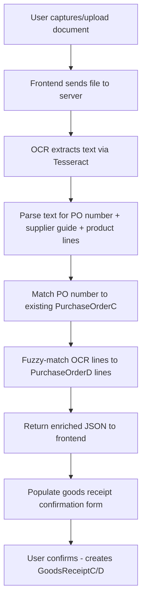
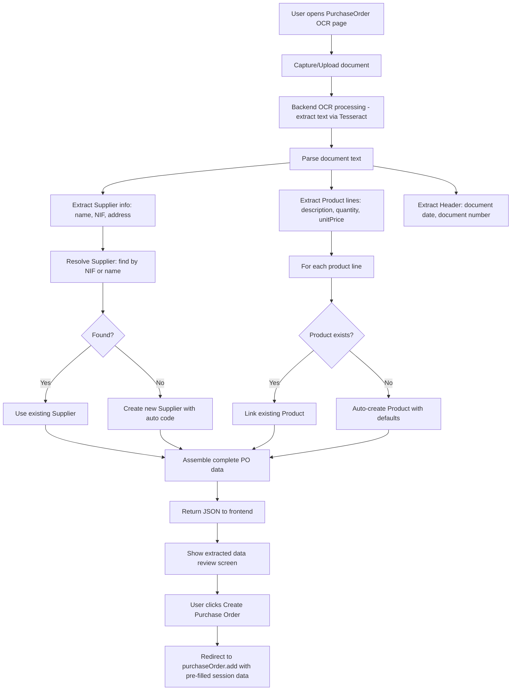
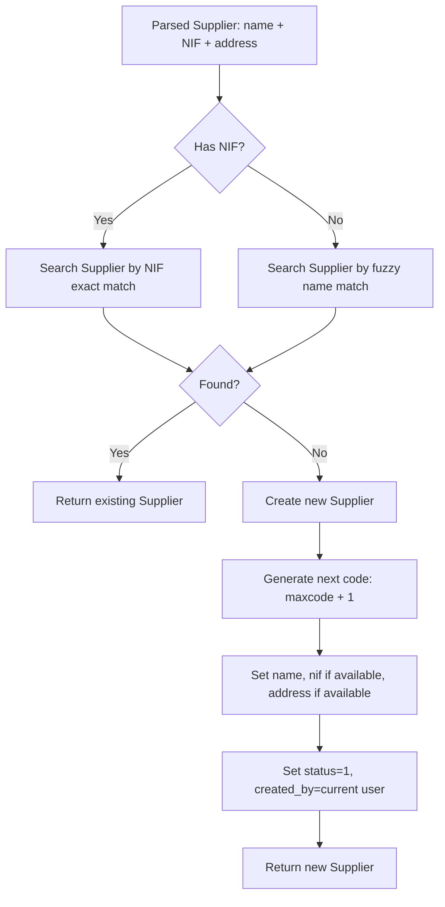
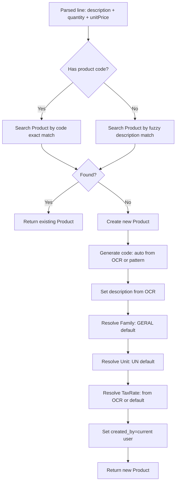
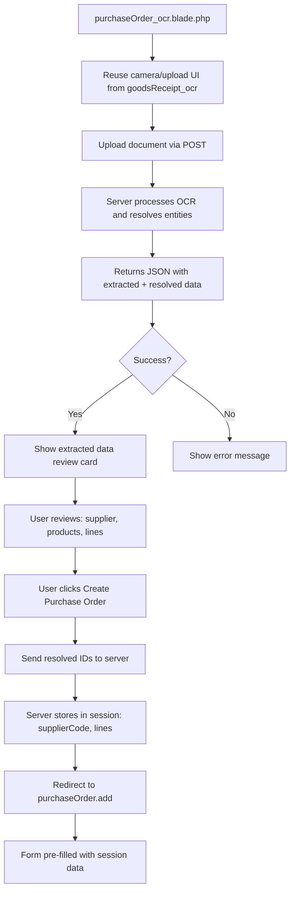
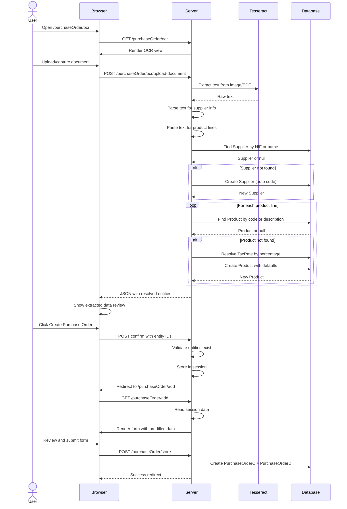

# Purchase Order OCR Feature - Architectural Plan

## 1. Overview

This plan describes the development of a new OCR-based feature for creating Purchase Orders (Encomendas a Fornecedores), analogous to the existing Goods Receipt OCR feature at [`resources/views/backend/goodsReceipt/goodsReceipt_ocr.blade.php`](resources/views/backend/goodsReceipt/goodsReceipt_ocr.blade.php).

The key difference: instead of registering a goods receipt against an existing purchase order, the new feature will **create a new Purchase Order** by:
1. OCR-extracting supplier info and product lines from a document
2. Auto-creating the Supplier if not found in the database
3. Auto-creating Products (articles) if not found
4. Resolving related entities: Tax Rates (IVA), Families, Units of Measure
5. Redirecting the user to the Purchase Order creation form with all data pre-filled for review

---

## 2. Current System Architecture

### 2.1 Database Schema (Key Tables)

| Table | Key Fields | Notes |
|-------|-----------|-------|
| [`Supplier`](database/migrations/2026_04_19_100001_create_supplier_table.php) | `code` (int, PK), `name`, `nif`, `address1`, `address2`, `town`, `postalCode`, `status` | Supplier master data |
| [`Product`](database/migrations/2026_03_26_224120_create_products_table.php) | `code` (string, PK), `description`, `family`, `unit`, `taxRateCode`, `image` | Article master data |
| [`Family`](database/migrations/2026_04_19_100002_create_family_table.php) | `family` (string, PK) | Product families/categories |
| [`UnitMeasure`](database/migrations/2026_04_19_100003_create_unit_measure_table.php) | `unit` (string, PK) | Units like UN, KG, LT |
| [`TaxRate`](database/migrations/2026_04_19_100004_create_tax_rate_table.php) | `taxRateCode` (int, PK), `descriptionTaxRate`, `taxRate` (percentage) | VAT rates |
| [`PurchaseOrderC`](database/migrations/2026_04_01_111024_create_purchase_order_c_s_table.php) | `id`, `pONumber`, `supplierCode`, `pODate`, `pOObservation`, `financialDiscount`, `totalNet`, `totalTax`, `totalGross`, `status` | Purchase Order header |
| [`PurchaseOrderD`](database/migrations/2026_04_01_111033_create_purchase_order_d_s_table.php) | `id`, `pONumber`, `productCode`, `productFamily`, `productUnit`, `taxRateCode`, `quantity`, `deliveryQuantity`, `unitPrice` | Purchase Order lines |

### 2.2 Current Goods Receipt OCR Flow



### 2.3 Key Purchase Order Form Behavior

The existing [`purchaseOrderC_add.blade.php`](resources/views/backend/purchaseOrder/purchaseOrderC_add.blade.php) view is powered by JavaScript in [`purchaseOrderForm.js`](resources/js/purchaseOrder/purchaseOrderForm.js) which:
- Loads a `data-products` JSON attribute with all products (code, description, family, unit, taxRateCode, taxRate, stockQuantity)
- Loads `data-initial-lines` JSON for pre-filling lines on edit
- Uses `addLine(product, quantity, unitPrice)` to dynamically add table rows
- Requires products to pre-exist in the `productIndex` object

This means the PO form **cannot accept new products that don't exist in the database** — they must be created first.

---

## 3. Proposed Architecture for Purchase Order OCR

### 3.1 High-Level Flow



### 3.2 Entity Resolution Strategy

#### Supplier Resolution [`findOrCreateSupplier()`]



**Key decisions for Supplier creation:**
- **Code**: Auto-increment from `max(Supplier.code) + 1`
- **Name**: Required - extracted from OCR
- **NIF**: Optional - extracted if available
- **address1/address2/town**: Optional - extracted if available
- **postalCode**: Optional - extracted if available
- **status**: Default `1` (active)

#### Product Resolution [`findOrCreateProduct()`]



**Key decisions for Product creation:**
- **Code**: Extract from OCR if available, otherwise auto-generate (e.g., `ART-XXXXX`)
- **Description**: Required - extracted from OCR
- **Family**: Use a configurable default (e.g., `GERAL`). Create if not exists.
- **Unit**: Use a configurable default (e.g., `UN`). Create if not exists.
- **taxRateCode**: Resolve by matching the extracted VAT percentage against the `TaxRate` table. If not resolvable, use a configurable default tax rate.

#### Tax Rate Resolution [`resolveTaxRate()`]

Since the OCR may extract VAT percentages like "23%", "IVA 23%", "13%", "6%":

1. Parse percentage from text (regex: `\b(\d{1,3})\s*%`)
2. Look up in `TaxRate` table by matching `taxRate` field
3. If found → return `taxRateCode`
4. If not found → return configured default (e.g., the standard rate for the country)

### 3.3 Default Configuration

Add a configuration section (e.g., in [`config/app.php`](config/app.php) or a new `config/purchaseorder.php`):

```php
return [
    'ocr' => [
        'default_family' => 'GERAL',
        'default_unit' => 'UN',
        'default_tax_rate_code' => 1, // e.g., 23% IVA
        'auto_create_supplier' => true,
        'auto_create_product' => true,
        'product_code_prefix' => 'ART-',
    ],
];
```

### 3.4 Routes

New routes to add to the `purchaseOrder` controller group in [`routes/web.php`](routes/web.php):

```php
Route::get('/purchaseOrder/ocr', 'showPurchaseOrderOCR')->name('purchaseOrder.ocr');
Route::post('/purchaseOrder/ocr/upload-document', 'uploadPurchaseOrderDocument')->name('purchaseOrder.ocr.upload');
Route::get('/purchaseOrder/ocr/test', 'testPurchaseOrderOCR')->name('purchaseOrder.ocr.test');
```

### 3.5 Controller: Methods to Add to [`PurchaseOrderController`](app/Http/Controllers/Actl/PurchaseOrderController.php)

| Method | Purpose |
|--------|---------|
| `showPurchaseOrderOCR()` | Render the OCR view [`purchaseOrder_ocr.blade.php`](resources/views/backend/purchaseOrder/purchaseOrder_ocr.blade.php) |
| `uploadPurchaseOrderDocument(Request)` | Handle document upload, OCR processing, entity resolution, return JSON |
| `testPurchaseOrderOCR()` | Diagnostic endpoint (copy from existing `testOCR`) |
| `findOrCreateSupplierFromOcr(array)` | Find supplier by NIF/name, or create new |
| `findOrCreateProductFromOcr(array)` | Find product by code/description, or create new |
| `resolveTaxRateFromOcr(float)` | Match VAT percentage to TaxRate table |
| `parsePurchaseOrderDocument(string)` | Parse OCR text for Purchase Order context (supplier info, product lines) |

### 3.6 OCR Text Parsing Strategy for Purchase Orders

The parser must extract different fields than the Goods Receipt parser. Expected document structure:

```
FORNECEDOR: Acme Corp, Lda
NIF: 123456789
MORADA: Rua Example, 123, Lisboa

ARTIGO               QTD   PREÇO   IVA
ROLHA NATURAL 24x44  500   0,35    23%
GARRAFA BORDEALESA   200   0,80    23%
CÁPSULA DOURADA      1000  0,05    13%
```

**Parse patterns needed:**
1. **Supplier name**: `FORNECEDOR:\s*(.+)` or similar patterns
2. **Supplier NIF**: `NIF:?\s*(\d{9})` or `N\.?I\.?F\.?:?\s*(\d{9})`
3. **Supplier address**: `MORADA:?\s*(.+)` or `ENDEREÇO:?\s*(.+)`
4. **Product lines**: Tabular data with description, quantity, unit price, optionally tax rate
5. **Document date**: `DATA:?\s*(\d{2}[/-]\d{2}[/-]\d{4})`

### 3.7 Frontend Flow



**Data structure returned from OCR endpoint:**

```json
{
  "success": true,
  "data": {
    "supplier": {
      "code": 5,
      "name": "Acme Corp, Lda",
      "nif": "123456789",
      "isNew": false
    },
    "lines": [
      {
        "productCode": "ART-001",
        "productDescription": "ROLHA NATURAL 24x44",
        "quantity": 500,
        "unitPrice": 0.35,
        "taxRateCode": 1,
        "taxRate": 23.0,
        "isNewProduct": false
      }
    ],
    "documentDate": "2026-05-20",
    "documentNumber": "FT 12345"
  }
}
```

### 3.8 Session-based Pre-fill Strategy

After the user confirms the OCR results, the server will:

1. Validate that all suppliers and products exist (they were created in step 1)
2. Store in session:
   - `ocr_po_supplier_code`
   - `ocr_po_lines` (array of productCode, quantity, unitPrice)
3. Redirect to [`purchaseOrder.add`](routes/web.php:109) route
4. The existing [`PurchaseOrderAdd`](app/Http/Controllers/Actl/PurchaseOrderController.php:56) method reads from session for pre-filling
5. The JavaScript `initialLines` mechanism automatically renders the lines

**Modification needed in `PurchaseOrderAdd()`:**

```php
public function PurchaseOrderAdd()
{
    // ... existing code ...
    
    // Handle OCR pre-fill
    $ocrSupplierCode = session('ocr_po_supplier_code');
    $ocrLines = session('ocr_po_lines', []);
    
    if ($ocrSupplierCode) {
        // Override selected supplier
        $selectedSupplierCode = $ocrSupplierCode;
        // Clear session after reading
        session()->forget(['ocr_po_supplier_code', 'ocr_po_lines']);
    }
    
    $initialLines = !empty($ocrLines) 
        ? $this->normalizeLinesForForm(collect($ocrLines))
        : $this->normalizeLinesForForm(collect(old('lines', [])));
    
    // ... rest of existing code ...
}
```

### 3.9 New View: [`purchaseOrder_ocr.blade.php`](resources/views/backend/purchaseOrder/purchaseOrder_ocr.blade.php)

Reuses the core components from [`goodsReceipt_ocr.blade.php`](resources/views/backend/goodsReceipt/goodsReceipt_ocr.blade.php):
- Same camera capture / file upload UI
- Same processing indicator
- Different extracted data display (supplier card, product lines table)
- Different action button: "Create Purchase Order" instead of "Confirm Goods Receipt"

The view should show a review section with:
- **Supplier info card**: Name, NIF, address, status (new or existing)
- **Products table**: Code, Description, Quantity, Unit Price, VAT, Status (new or existing)
- **Action buttons**: "Create Purchase Order" or "Cancel"

---

## 4. Implementation Steps (Todo List)

### Step 1: Configuration & Defaults
- Add `config/purchaseorder.php` with OCR defaults (default family, unit, tax rate, auto-create flags, product code prefix)
- These defaults will be used during product/supplier auto-creation

### Step 2: Controller Methods - Entity Resolution
- Add `findOrCreateSupplierFromOcr()` - resolves or creates Supplier
- Add `findOrCreateProductFromOcr()` - resolves or creates Product with Family/Unit/TaxRate defaults
- Add `resolveTaxRateFromOcr()` - matches VAT percentage to TaxRate table
- All with proper logging and transaction support

### Step 3: Controller Methods - OCR Processing
- Add `parsePurchaseOrderDocument()` - parses OCR text for PO-specific fields
- Add `uploadPurchaseOrderDocument()` - main endpoint handler using entity resolution
- Add `showPurchaseOrderOCR()` - renders the view
- Add `testPurchaseOrderOCR()` - diagnostic endpoint

### Step 4: Modify PurchaseOrderAdd for Session Pre-fill
- Update `PurchaseOrderAdd()` in [`PurchaseOrderController`](app/Http/Controllers/Actl/PurchaseOrderController.php) to read from session
- Clear session after reading to prevent stale data

### Step 5: New View - purchaseOrder_ocr.blade.php
- Create the OCR view reusing camera/upload components
- Create the extracted data review display
- Add confirmation flow to redirect to add form

### Step 6: New Routes
- Add routes in [`routes/web.php`](routes/web.php) for the three new endpoints

### Step 7: Supplier Auto-Creation Validation
- Ensure supplier auto-creation handles edge cases:
  - NIF already exists with different name
  - Name fuzzy match with multiple candidates
  - Missing NIF and no name match → create with caution

### Step 8: Product Auto-Creation Validation
- Ensure product auto-creation handles:
  - Default family `GERAL` may not exist → create it
  - Default unit `UN` may not exist → create it
  - Default tax rate may not exist → prompt user or fail gracefully
  - Duplicate product descriptions → append suffix or warn

### Step 9: Error Handling & Rollback
- Wrap entity creation in DB transactions
- If supplier creation succeeds but product creation fails, roll back
- Provide clear error messages in Portuguese
- Add validation that required defaults exist before processing

### Step 10: Testing
- Test with sample documents (supplier invoice format)
- Verify entity auto-creation works
- Verify form pre-fill works after OCR confirmation
- Test error scenarios (missing Tesseract, invalid documents)

---

## 5. Risk Analysis & Mitigations

| Risk | Impact | Mitigation |
|------|--------|------------|
| OCR misreads supplier name, creates duplicate | Low | Use NIF as primary match; fuzzy name as secondary |
| OCR misreads product descriptions | Medium | Show review screen before creation; user can edit |
| Default family/unit/tax rate don't exist | High | Create defaults automatically if missing; validate before OCR |
| Document format varies widely | Medium | Build flexible regex patterns; show extracted text for manual correction |
| Auto-created products have incomplete data | Medium | Only require code + description; user can edit later |
| Transactional integrity | Medium | Wrap all entity creation in DB::transaction |

---

## 6. Sequence Diagram (Detailed Flow)



---

## 7. Files to Create / Modify Summary

### New Files
| File | Purpose |
|------|---------|
| [`config/purchaseorder.php`](config/) | OCR default configuration |
| [`resources/views/backend/purchaseOrder/purchaseOrder_ocr.blade.php`](resources/views/backend/purchaseOrder/) | OCR capture & review view |

### Modified Files
| File | Changes |
|------|---------|
| [`routes/web.php`](routes/web.php) | Add 3 new OCR routes under purchaseOrder group |
| [`app/Http/Controllers/Actl/PurchaseOrderController.php`](app/Http/Controllers/Actl/PurchaseOrderController.php) | Add ~6 new methods for OCR processing + entity resolution |

### Files That May Need Minor Changes
| File | Changes |
|------|---------|
| [`app/Http/Controllers/Actl/PurchaseOrderController.php`](app/Http/Controllers/Actl/PurchaseOrderController.php) - `PurchaseOrderAdd()` method | Add session-based pre-fill logic |

---

## 8. Questions for Discussion

1. **Product Code Generation**: How should new products be coded? Should we use a prefix like `ART-` + auto-increment, or extract product codes from the document?

2. **Default Family**: Should `GERAL` be hardcoded, or should the user choose? Should we create it automatically if missing?

3. **Default Unit**: Same question - `UN` as default, or configurable?

4. **Supplier Duplicate Prevention**: If two suppliers have the same name but different NIFs, how should we handle?

5. **Review Screen**: Should the user be able to edit the extracted data before confirming (on the OCR page itself), or should we just redirect to the PO form where they can edit everything?

6. **Document Number**: Should the extracted document number be stored somewhere (e.g., as observation text in the PO)?
